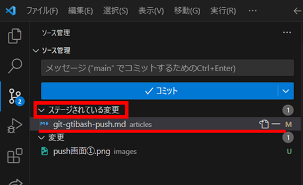

## はじめに

### 【目標】

VisualStudioCode で Push をして、github や zenn に変更内容を保存・更新する。

### 【必要なもの】

- github 上のリポジトリ
- VisualStudioCode
- push したいフォルダーまたはファイル

### 【覚えておきたい単語】

- comit：ソースコードをリポジトリに更新する作業

- push:ローカルリポジトリ(自分の PC 内のみ)の内容をリモートリポジトリ(github などオンライン上)に送る

## 手順

1. visualstudiocode を起動して、push したいファイルを開く

2. 画面左側にあるソース管理のアイコンをクリックする

   

3. push したいファイルの横にある`＋`を押して、状態を`変更`から`ステージされている変更`へ移動させる

   

   

4. `メッセージ`の入力をする(画像内で"push test"と記述されている部分)

   

5.` コミット`ボタンの横にある`✔`をクリックする
　 →`コミットしてプッシュ`を選択

6. 終了！
   github や zenn をリロードして、内容が変更されているか確認をしてみましょう
