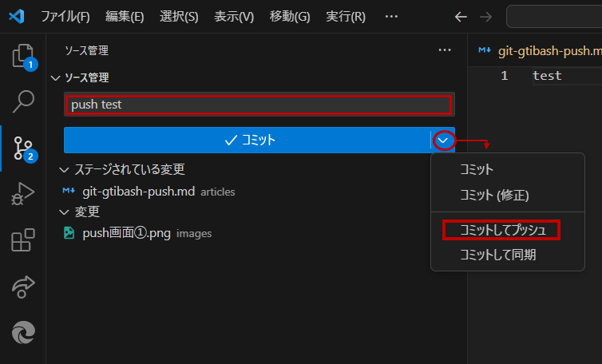

---

title: "VisualStudioCodeでPushをする" # 記事のタイトル

emoji: "👩‍🚀" # アイキャッチとして使われる絵文字（1文字だけ）

type: "tech" # tech: 技術記事 / idea: アイデア記事

topics: ["aws", "iam", "github"] # タグ。["markdown", "rust", "aws"]のように指定する

published: false # 公開設定（falseにすると下書き）

---
## はじめに
【目標】
VisualStudioCodeでPushをして、githubやzennに変更内容を保存する

【必要なもの】
・VisualStudioCode
・pushしたいフォルダーまたはファイル

## 手順
1. visualstudiocodeを起動して、pushしたいファイルを開く

2. ソース管理のアイコンをクリックする

3. pushしたいファイルの横にある`＋`を押して、状態を`変更`から`ステージされている変更`へ移動させる

4. メッセージの入力をする(画像内で"push test"と記述されている部分)

5. コミットボタンの横にある`✔`をクリックする
　→`コミットしてプッシュ`を選択

6. 終了！